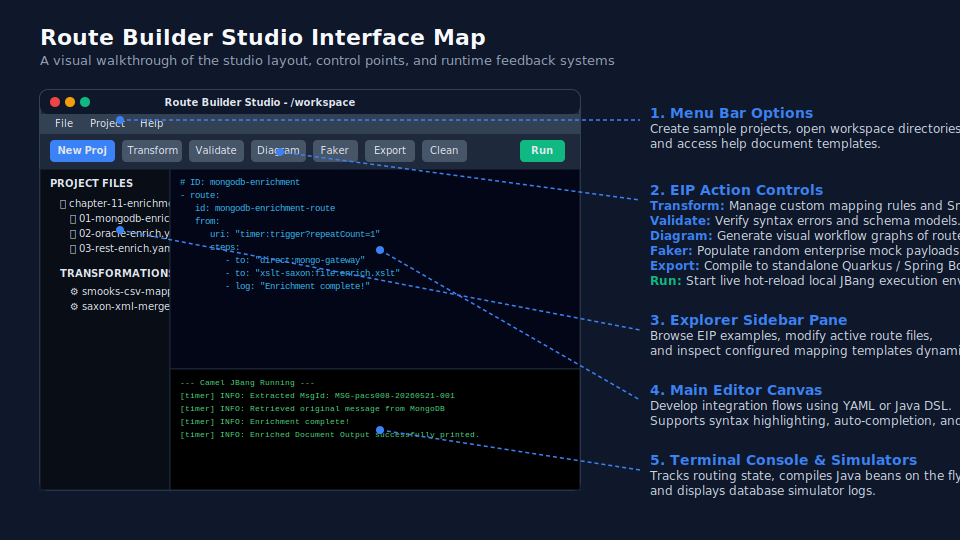

# Route Builder Studio User Guide

Route Builder Studio is a visual desktop application for constructing, testing, mapping, and exporting Apache Camel integration routes using JBang. 



This guide covers:
1. **Bootstrap & Project Creation**
2. **Infrastructure Simulators (REST, MongoDB, Oracle)**
3. **Transformation Studio** (including Smooks, Joor, Groovy, XSLT, JSLT, etc.)
4. **Validation Studio**
5. **Diagram Studio**
6. **Universal Faker & Template Studio**
7. **Build & Export**

---

## 1. Getting Started & Creating a Sample Project

When you launch Route Builder Studio, you can bootstrap a workspace or create a pre-configured sample integration project.

### Creating a Sample Camel Project
1. Open the **File** menu from the top menu bar.
2. Select **New** -> **Sample Camel Project**.
3. Choose a destination directory.
4. The application will generate a complete learning environment including:
   - Chapters 1 to 10 of EIP routing examples.
   - Chapter 11 (Advanced Enrichment examples).
   - An `infra-simulator` suite with MongoDB, Oracle DB, and REST API mocks.
   - A pre-configured `application.properties` file.

---

## 2. Infrastructure Simulators

Route Builder Studio bundles zero-dependency mock infrastructure gateways to simulate enterprise resources.

### Simulated MongoDB Gateway
* **URI**: `direct:mongo-gateway`
* **Java Class**: `mongodb.engine.MongoGateway`
* **Operations Supported**:
  * `insert`: Inserts documents into the mock collection files under `/infra-simulator/mongodb/data/<collection>.json`.
  * `findOne`: Queries documents by ID.
  * `findAll`: Returns all records in a collection.
  * `delete`: Deletes a document by ID.

### Simulated Oracle Database Gateway
* **URI**: `direct:oracle-gateway`
* **Java Class**: `oracle.engine.OracleGateway`
* **Operations Supported**:
  * `insert`: Appends row records into the table JSON under `/infra-simulator/oracle/data/<table>.json`.
  * `select`: Queries rows matching a column and value.
  * `selectAll`: Returns all records.

### REST API Simulator Gateway
* **URI**: Exposes HTTP endpoints using the `platform-http` component.
* **Endpoints**:
  * `POST http://localhost:9999/api/mongo/insert?collection=<name>`
  * `GET http://localhost:9999/api/mongo/query?collection=<name>&id=<id>`
  * `GET http://localhost:9999/api/oracle/query?table=<name>&column=<col>&value=<val>`

---

## 3. Transformation Studio

The **Transformation Studio** enables complex mapping configurations, template compilation, and snippet generation.

### Accessing the Studio
Click the **Transform** button on the toolbar or select a transformation config file (like `transformation.json`) to open it.

### Creating a New Transformation
1. Right-click the **Left Tree Pane** under the Transformation Explorer.
2. Choose from supported transformation engines:
   * **Smooks**: Used for flat files, JSON, EDI, or XML parsing.
   * **Joor**: Inlined Java code compiling at runtime.
   * **Groovy**: Fast scripting transformations.
   * **XSLT / XSLT-Saxon**: Merging and restructuring XML streams.
   * **JSLT**: JSON-to-JSON transformations.
   * **Freemarker / FTL**: Template-based rendering.
3. Configure the source formats (JSON, XML, CSV, etc.) and output target schema.

### Writing Smooks Configurations
Since Smooks 2.x, all parsed formats must export their results to a Sink to be captured by Camel:
```xml
<core:exports xmlns:core="https://www.smooks.org/xsd/smooks/smooks-core-1.6.xsd">
    <core:result type="org.smooks.io.sink.StringSink" />
</core:exports>
```

### Advanced Merging/Enrichment (XSLT 2.0 / Saxon)
To combine a truncated message and an original message, wrap them in an `<envelope>` and apply Saxon:
```yaml
- to: "xslt-saxon:file:enrich.xslt"
```
*(See **Chapter 11** in the sample project for fully functional MongoDB, Oracle, and REST API XML enrichment examples).*

---

## 4. Validation Studio

Ensure route correctness and schema compliance.
* Click **Validate** on the toolbar.
* Validate YAML/Java Camel DSL structure correctness.
* Perform schema validations (XSD, JSON schema) on mapping inputs.

---

## 5. Diagram Studio

Visualize complex routes instantly:
* **Interactive Code & Flow Mapping**: As you write or edit your Camel integration routes, Diagram Studio updates the visual rendering in real-time.
* **Flow Chart Rendering**: Click **Diagram** on the toolbar to parse Camel steps (timer, setBody, transform, to, log, etc.) and generate a structured diagram of your EIP layout.
* **Step Highlights**: Click components in the diagram to jump directly to the corresponding line in the route code.

---

## 6. Testing Routes with JBang Stubs & Templates

Camel JBang allows rapid testing and debugging of integration routes locally without spinning up complete physical databases or broker architectures.

### Stubbing External Gateways
Instead of connecting to active services, use the pre-packaged simulators and stubs:
* **JMS/IBM MQ Stubs**: Chapter 3 contains examples of stubbing message queues (`chapter-03-messaging/02-jms-ibmmq-stub.camel.yaml`) to verify message consumption.
* **MongoDB & Oracle DB Mocks**: Query direct simulator URIs (`direct:mongo-gateway`, `direct:oracle-gateway`) which load mock data from JSON files on the fly.

### Template Mocks with Mustache & Freemarker
Use templating engines to dynamically construct test payloads and documents:
* **Mustache Components**: Inject variables into XML/JSON envelopes using Camel's `mustache:` component. E.g. `to: "mustache:templates/my-payload.mustache"`.
* **Dynamic Content Binding**: Combine mock headers, parameters, and payloads dynamically during local test execution.

---

## 7. Universal Faker & Template Studio

Generate randomized enterprise test data without writing mock code manually.

### Features
* Click **Faker** on the toolbar.
* **Persistent Settings**: Configure ranges, names, amounts, and format rules.
* Persisted configurations are saved to `/FAKER/` template folders.
* Generate and output structured files (CSV, XML, JSON) populated with rich mock data.

---

## 8. Build & Export

Once you have validated and tested your integration routes:
1. Click **Export** on the toolbar.
2. Choose to compile and run your routes locally using the JBang runtime.
3. Export your workspace as a standalone production-ready project:
   * **Quarkus-Camel Project**: Outputs a structured Quarkus Gradle/Maven project.
   * **Spring Boot-Camel Project**: Outputs a Spring Boot build project ready for deployment.

---

## 9. Appendix: Sample Project Chapters & Directory Reference

The generated sample Camel project is structured into chapters covering different integration levels:

### Basic Integration Routing
* **Chapter 01: Basics (`chapter-01-basics/`)**
  * `01-hello-timer.camel.yaml`: Introduces timer trigger events and logs.
  * `02-set-body-header.camel.yaml`: Sets values in headers and exchange body content.
  * `03-simple-expression.camel.yaml`: Uses Camel's Simple expression language for scripting.
* **Chapter 02: Routing EIPs (`chapter-02-routing/`)**
  * `01-choice-routing.camel.yaml`: Content-based router routing based on payload criteria.
  * `02-wiretap-audit.camel.yaml`: Asynchronously routes messages to audit destinations.
  * `03-filter-eip.camel.yaml`: Filters traffic matching predicate conditions.

### Messaging Silos & Integration Patterns
* **Chapter 03: Messaging (`chapter-03-messaging/`)**
  * `01-kafka-consumer.camel.yaml`: Listens to Kafka broker topics.
  * `02-jms-ibmmq-stub.camel.yaml`: Mock queue consumers for IBM MQ.
  * `03-mongodb-stub.camel.yaml`: Direct query and update patterns on simulated MongoDB databases.
* **Chapter 04: Error Handling (`chapter-04-error-handling/`)**
  * `01-global-exception.camel.yaml`: Implements global exception handlers.
  * `02-dotry-docatch.camel.yaml`: Focuses on route-level try/catch scopes.
  * `03-circuit-breaker.camel.yaml`: Prevents system overload using Circuit Breaker (Resilience4j).

### Advanced Transformation & Rest APIs
* **Chapter 05: Data Transformation (`chapter-05-transformation/`)**
  * `01-enrich-pattern.camel.yaml`: Dynamically retrieves secondary data to enrich payloads.
  * `02-split-aggregate.camel.yaml`: Splits list records and merges results into a single collection.
  * `03-multicast.camel.yaml`: Sends messages to multiple endpoints simultaneously in parallel.
* **Chapter 06: REST API Clients (`chapter-06-rest-api/`)**
  * `01-rest-producer.camel.yaml`: Consumes external REST services.
  * `02-rest-consumer.camel.yaml`: Publishes REST routes.

### Transactional Patterns & Microservices
* **Chapter 07: Enterprise Patterns (`chapter-07-enterprise/`)**
  * `01-saga-pattern.camel.yaml`: Handles long-running multi-step compensation actions.
  * `02-transactional-outbox.camel.yaml`: Safely stores event updates locally before broadcasting.
  * `03-dead-letter-channel.camel.yaml`: Redirects failed exchanges to DLQ queues.
* **Chapter 08: REST DSL Server (`chapter-08-rest-server/`)**
  * Contains CRUD actions, authentication headers, streaming, health indicators, and file uploads.
* **Chapter 09: Cryptography & Advanced Recovery (`chapter-09-crypto-audit/`)**
  * Explores payload AES-GCM encryption, XA transactions with Narayana, and exclusion filters.
* **Chapter 10: Beans & Custom Code (`chapter-10-beans-java/`)**
  * Binds Java logic and Camel routes using YAML configurations and raw Java classes.

### Advanced Enrichment
* **Chapter 11: Advanced Enrichment (`chapter-11-enrichment/`)**
  * Advanced real-world pacs.008 XML message restoration using database queries (MongoDB/Oracle/REST) and merging with Saxon XSLT 2.0.
