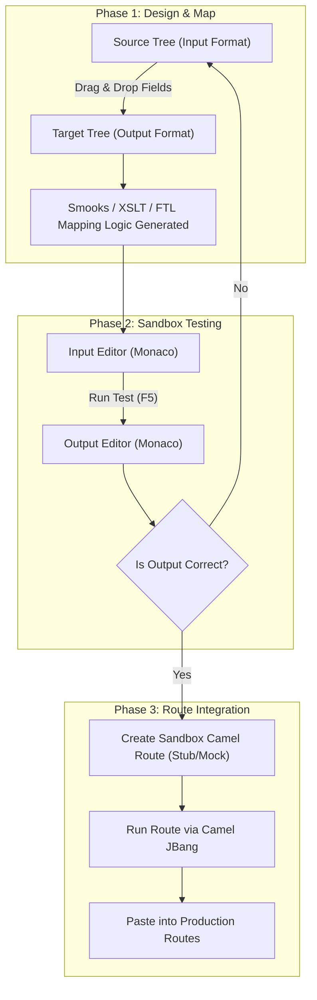

# Transformation Studio & Mapping Manual

Transformation Studio is a core module in the Route Builder suite designed to design, visually map, test, and verify complex data transformations. It bridges visual modeling and actual route execution, ensuring your data translates accurately across formats before you deploy it to production.

---

## 📐 Layout & Visual Mapping Workflow

The Transformation Studio is designed around a dual-pane editor that guides developers from visual design to sandbox execution.



### 1. The Visual tree Mapper
When mapping structured objects (such as XML to JSON, or CSV to XML):
- **Left Column**: Displays the Source Schema tree (representing fields in your input structure).
- **Middle Column**: Displays the Target Schema tree (representing fields in your output structure).
- **Mapping Action**: Drag a field node from the Source tree and drop it onto the Target tree. The studio dynamically appends mapping definitions to the underlying XML/JSON configuration files.

### 2. The Code Panel & Live Test Section
Switching to the **Code View** displays the generated configuration (e.g. `smooks-config.xml`, `transform.jslt`, or `template.ftl`) in a Monaco editor with full syntax highlighting.
- **Input Payload Editor (Bottom Left)**: Paste your raw test files (CSV, XML, JSON).
- **Result Output Editor (Bottom Right)**: Displays the converted output instantly.
- **Execution Console**: Prints detailed parse logs, compiler warnings, and Smooks parser diagnostics.

---

## 📂 Mapping Libraries & Profiles (samplemapping)

The workspace is pre-configured with several standard sample configurations under `src/main/resources/samplemapping/`:

| Directory | Mapping Strategy | Use Case | Target Configuration |
| :--- | :--- | :--- | :--- |
| **`smooks/smooks-csv`** | CSV to XML / Object | Parse records into structured XML beans | `smooks-config.xml` |
| **`smooks/smooks-fixed-length`** | Fixed-Width to XML | Parse legacy mainframe lines into XML | `smooks-config.xml` |
| **`smooks/smooks-yaml`** | YAML to XML | Translate configs or structures | `smooks-config.xml` |
| **`smooks/smooks-json`** | JSON to XML | Standard JSON translation | `smooks-config.xml` |
| **`freemarker-ftl`** | Template FTL | Map variables from JSON/XML to plain text | `template.ftl` |
| **`jslt-mapping`** | JSLT Declarative JSON | High-performance JSON-to-JSON | `transform.jslt` |
| **`groovy-transform`** | Scripted Groovy | Custom programmatic transformations | `transform.groovy` |
| **`joor-java-mapper`** | Runtime Java (jOOR) | Dynamic Java class conversions | `Transform.java` |
| **`flatpack-fixed`** | Flatpack parser | Map fixed-width / flat data sheets | `definition.xml` |
| **`mt-to-mx` / `mx-to-mt`** | SWIFT XSLT translation | Translate MT103 to Pacs.008 (and vice versa) | `transform.xslt` |
| **`enrichment`** | XSLT Pacs.008 | Enrich truncated XML messages with Oracle/REST data | `enrich.xslt` |

---

## 🚀 Testing Transformations in Sandbox Routes

Before pasting your transformation code into your production routes, you should verify it in a mock/sandbox Camel route using **Camel JBang**. This guarantees that components load correctly, routes boot cleanly, and datatypes map properly in-flight.

### Step 1: Create a Sandbox Route
Create a temporary YAML Camel route file (e.g., `temp-sandbox-route.camel.yaml`) inside your project directory:

```yaml
# camel-k: language=yaml
- from:
    uri: "direct:start"
    steps:
      # 1. Log the incoming test payload
      - log: "Received Input: ${body}"
      
      # 2. Execute the mapping using the appropriate component
      - to: "smooks:file:smooks-config.xml"
      
      # 3. Log the mapped result
      - log: "Transformation Result: ${body}"
      - to: "mock:result"
```

> [!NOTE]
> Change the `to` URI component depending on your transformation strategy:
> - **Smooks**: `to: "smooks:file:smooks-config.xml"`
> - **XSLT**: `to: "xslt:file:transform.xslt"`
> - **FreeMarker**: `to: "freemarker:file:template.ftl"`
> - **JSLT**: `to: "jslt:file:transform.jslt"`

### Step 2: Running with Camel JBang Stubs
Run the sandbox route locally from your terminal using Camel JBang:

```bash
jbang camel run temp-sandbox-route.camel.yaml
```

This starts a lightweight Camel engine in the background that auto-detects dependencies (such as `camel-smooks` or `camel-freemarker`) and spins up the endpoints.

### Step 3: Triggering a Test Run
In another terminal, or using the studio's console interface, publish a test payload to the `direct:start` endpoint. For example, using JBang CLI:

```bash
jbang camel send direct:start --body=@source.csv
```

Observe the logs inside the running JBang console:
```log
[camel-1] Received Input: id,name,price\n101,Widget,49.99
[camel-1] Transformation Result: <Order><Id>101</Id><Name>Widget</Name><Price>49.99</Price></Order>
```

---

## 💾 Final Integration

Once you have verified that the sandbox route runs cleanly and outputs correctly:

1. Copy the mapping template file (e.g., `smooks-config.xml`) into your project resources directory: `src/main/resources/mappings/`.
2. Reference it in your final Camel route DSL:
   ```xml
   <route id="pacs008-processing-route">
       <from uri="activemq:queue:pacs008.in"/>
       <to uri="smooks:classpath:mappings/smooks-config.xml"/>
       <to uri="activemq:queue:pacs008.out"/>
   </route>
   ```
3. Run `clean.sh` to remove any temporary `temp-*.camel.yaml` sandbox files.
