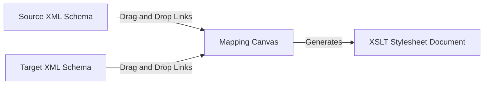

# Data Transformation & XSLT Studio

Transforming messages between different structural layouts is a critical step in enterprise pipelines. The IDE integrates two dedicated mapping tools.

---

## 1. Data Transformation Studio
The **Data Transformation Studio** generates code and custom mapping rules to map keys, values, and structures from a source payload to a target format.

- **Interactive Layout Mapper**: Map fields between source and destination JSON/YAML schemas.
- **Dynamic Output Preview**: View real-time outputs of mapping executions on custom test payloads.
- **Rule Configurations**: Set default value fallbacks, math actions, and string manipulations on mappings.

---

## 2. XSLT Graphical Mapper
The **XSLT Mapper** translates structured XML document trees into other XML configurations, HTML tables, or custom text layouts.

- **Two-Tree Canvas View**: Visually inspect source XML nodes on the left tree and target schema nodes on the right tree.
- **Drag-and-Drop Mapping Paths**: Draw mapping lines from source nodes to target nodes to declare values.
- **Code Synchronization**: Recompile the visual line connections into clean `<xsl:template>` blocks and stylesheet definitions inside the Monaco editor on the fly.
