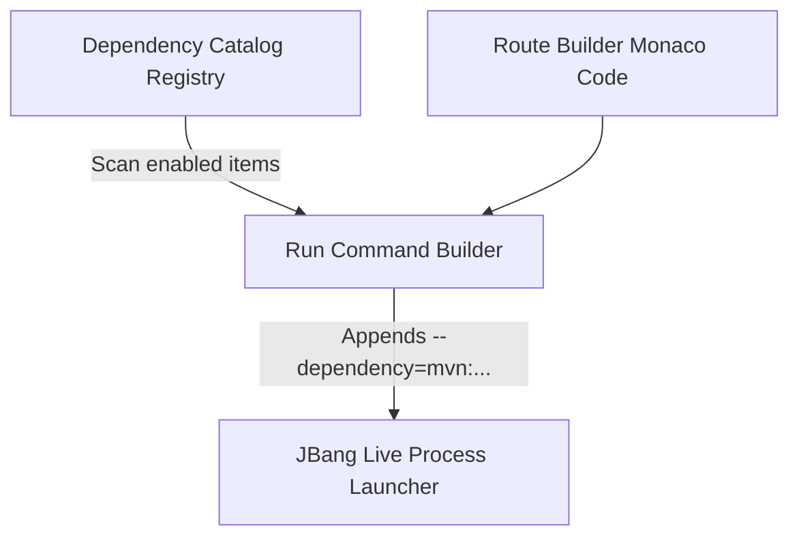

# Managed Dependency Catalog

Developing Camel routes often requires external drivers and client library dependencies (e.g., IBM MQ, Solace, databases). The **Dependency Catalog** provides centralized version controls and automatic injection parameters.

---

## 1. Registry Catalog

The IDE maintains a registry in `dependency-catalog.json` located within the workspace. By default, it initializes with pre-configured enterprise dependencies:

| Group ID | Artifact ID | Version | Description |
| :--- | :--- | :--- | :--- |
| `com.ibm.mq` | `com.ibm.mq.jakarta.client` | `9.3.5.0` | IBM MQ client libraries for standard & secure queues. |
| `org.messaginghub` | `pooled-jms` | `3.1.2` | Connection pool for JMS operations. |
| `org.apache.camel.quarkus` | `camel-quarkus-paho-mqtt5` | `3.8.0` | MQTT client for message brokers. |
| `com.solacesystems` | `sol-jms` | `10.23.0` | Solace PubSub+ client libraries. |
| `org.mongodb` | `mongodb-driver-sync` | `4.11.1` | Native MongoDB client. |

---

## 2. Injected Run Workflow

When a dependency is marked as **Enabled** in the catalog, it is automatically injected into all run configurations without developers needing to declare maven coordinates in YAML files manually.



---

## 3. Inline Header Injection

For developers exporting routes to standalone files, the catalog provides a **"Inject Headers"** button. This automatically writes the selected dependency declarations as comments at the top of the currently active file:

```yaml
# camel-k: dependency=mvn:com.ibm.mq:com.ibm.mq.jakarta.client:9.3.5.0
# camel-k: dependency=mvn:org.messaginghub:pooled-jms:3.1.2
```
This guarantees the file remains self-contained and run-ready on any standard Camel cluster.
