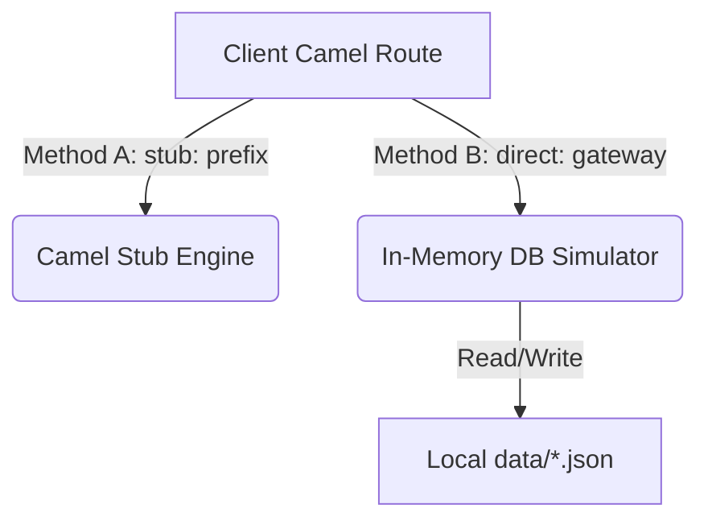

# Zero-Port Infrastructure Simulation Guide

This guide details the architecture, design, and developer workflows for simulating external infrastructure (such as databases, messaging brokers, or APIs) inside Apache Camel routes without binding network ports or running local servers.

---

## 1. Architectural Overview

When developing integrations offline or in air-gapped dev environments, developers often struggle to run external dependencies (like MongoDB or Oracle SQL instances) on their local machines due to port conflicts or missing credentials.

To solve this, we use two dynamic simulation patterns:



### Pattern comparison:
| Pattern | How it works | Ideal for | Statefulness |
| :--- | :--- | :--- | :--- |
| **Component Stubbing** | Prefix endpoints with `stub:` (e.g. `stub:kafka:topic`) | Outbound logs, MQ/Kafka bypasses | Stateless (empty mock) |
| **Gateway Facades** | Route database traffic to `direct:` simulator routes | Query operations, mock records, testing transforms | Stateful (persists to JSON files) |

---

## 2. Stateful Gateway Layout

All simulators are localized inside the `/infra-simulator/` folder under your project workspace:

```
infra-simulator/
  ├── mongodb/
  │     ├── beans/
  │     │     └── MongoGateway.java             # Persistence logic for collections
  │     ├── example/
  │     │     └── 01-mongodb-simulator-example.camel.yaml
  │     ├── MongoGatewayRoute.camel.yaml        # Gateway entrypoint
  │     └── data/
  │           └── mx_data.json                  # Collection DB file
  └── oracle/
        ├── beans/
        │     └── OracleGateway.java            # Persistence logic for SQL queries
        ├── example/
        │     └── 02-oracle-simulator-example.camel.yaml
        ├── OracleGatewayRoute.camel.yaml       # Gateway entrypoint
        └── data/
              └── users_table.json              # Table DB file
```

---

## 3. MongoDB Emulator Specification

### Persistence Handler (`mongodb/beans/MongoGateway.java`)
Manages collection persistence dynamically. When you query a collection, it reads `infra-simulator/mongodb/data/${collection}.json`.

```java
package mongodb.beans;

import com.fasterxml.jackson.databind.ObjectMapper;
import com.fasterxml.jackson.databind.JsonNode;
import com.fasterxml.jackson.databind.node.ArrayNode;
import java.io.File;
import java.util.Iterator;

public class MongoGateway {
    private static final ObjectMapper mapper = new ObjectMapper();

    private static File getCollectionFile(String collection) {
        String baseDir = System.getProperty("user.dir");
        File dataDir = new File(baseDir + "/infra-simulator/mongodb/data");
        if (!dataDir.exists()) dataDir.mkdirs();
        return new File(dataDir, collection + ".json");
    }

    public static String process(String inputJson) {
        try {
            JsonNode request = mapper.readTree(inputJson);
            String operation = request.get("operation").asText();
            String collection = request.get("collection").asText();
            File file = getCollectionFile(collection);
            ArrayNode list = (file.exists() && file.length() > 0) 
                ? (ArrayNode) mapper.readTree(file) 
                : mapper.createArrayNode();

            if ("insert".equalsIgnoreCase(operation)) {
                JsonNode doc = request.get("document");
                String newId = doc.get("id").asText();
                for (JsonNode node : list) {
                    if (node.get("id").asText().equals(newId)) {
                        return "{\"status\": \"error\", \"message\": \"Duplicate ID\"}";
                    }
                }
                list.add(doc);
                mapper.writerWithDefaultPrettyPrinter().writeValue(file, list);
                return "{\"status\": \"inserted\", \"id\": \"" + newId + "\"}";
            } 
            else if ("findOne".equalsIgnoreCase(operation)) {
                String queryId = request.get("query").get("id").asText();
                for (JsonNode node : list) {
                    if (node.has("id") && node.get("id").asText().equals(queryId)) {
                        return mapper.writeValueAsString(node);
                    }
                }
                return "{\"error\": \"Document not found\"}";
            } 
            else if ("findAll".equalsIgnoreCase(operation)) {
                return mapper.writeValueAsString(list);
            }
            return "{\"error\": \"Unsupported operation\"}";
        } catch (Exception e) {
            return "{\"status\": \"error\", \"message\": \"" + e.getMessage() + "\"}";
        }
    }
}
```

### Client Route Integration (YAML)
```yaml
# 1. Insert a document into pacs008 collection
- setBody:
    constant: >
      {
        "operation": "insert",
        "collection": "pacs008",
        "document": {
          "id": "MX-101",
          "amount": 2500.00
        }
      }
- to: "direct:mongo-gateway"

# 2. Query document back from pacs008 collection
- setBody:
    constant: >
      {
        "operation": "findOne",
        "collection": "pacs008",
        "query": { "id": "MX-101" }
      }
- to: "direct:mongo-gateway"
```

---

## 4. Oracle Database Emulator Specification

### Query Processor (`oracle/beans/OracleGateway.java`)
Parses JSON SQL wrapper commands and maps DB tables to local `/oracle/data/${table}.json` files.

```java
package oracle.beans;

import com.fasterxml.jackson.databind.ObjectMapper;
import com.fasterxml.jackson.databind.JsonNode;
import com.fasterxml.jackson.databind.node.ArrayNode;
import java.io.File;
import java.util.Iterator;

public class OracleGateway {
    private static final ObjectMapper mapper = new ObjectMapper();

    private static File getTableFile(String table) {
        String baseDir = System.getProperty("user.dir");
        File dataDir = new File(baseDir + "/infra-simulator/oracle/data");
        if (!dataDir.exists()) dataDir.mkdirs();
        return new File(dataDir, table + ".json");
    }

    public static String execute(String requestJson) {
        try {
            JsonNode request = mapper.readTree(requestJson);
            String queryType = request.get("queryType").asText();
            String table = request.get("table").asText();
            File file = getTableFile(table);
            ArrayNode list = (file.exists() && file.length() > 0) 
                ? (ArrayNode) mapper.readTree(file) 
                : mapper.createArrayNode();

            if ("insert".equalsIgnoreCase(queryType)) {
                JsonNode row = request.get("row");
                String newId = row.get("id").asText();
                list.add(row);
                mapper.writerWithDefaultPrettyPrinter().writeValue(file, list);
                return "{\"status\": \"row_inserted\", \"id\": \"" + newId + "\"}";
            } 
            else if ("select".equalsIgnoreCase(queryType)) {
                String col = request.get("column").asText();
                String val = request.get("value").asText();
                ArrayNode results = mapper.createArrayNode();
                for (JsonNode row : list) {
                    if (row.has(col) && row.get(col).asText().equals(val)) {
                        results.add(row);
                    }
                }
                return mapper.writeValueAsString(results);
            }
            return "{\"error\": \"Unsupported SQL query type\"}";
        } catch (Exception e) {
            return "{\"status\": \"error\", \"message\": \"" + e.getMessage() + "\"}";
        }
    }
}
```

### Client Route Integration (YAML)
```yaml
# Querying simulated table in Oracle database
- setBody:
    constant: >
      {
        "queryType": "select",
        "table": "customers_table",
        "column": "id",
        "value": "MX-801"
      }
- to: "direct:oracle-gateway"
- log: "Oracle SELECT response: ${body}"
```

---

## 5. Development Workflow & Air-Gapped Setup

1. **Changing Data**: There is **no need to modify Java code**. Simply edit the JSON data files under `data/` or create new ones (the simulator will automatically mount new collections/tables based on the filenames).
2. **Offline Execution**: Running the simulators requires Jackson dependencies. Use the local maven precaching script (`precache-camel.sh`) or cache them dynamically using:
   ```bash
   jbang camel run infra-simulator/mongodb/MongoGatewayRoute.camel.yaml
   ```
