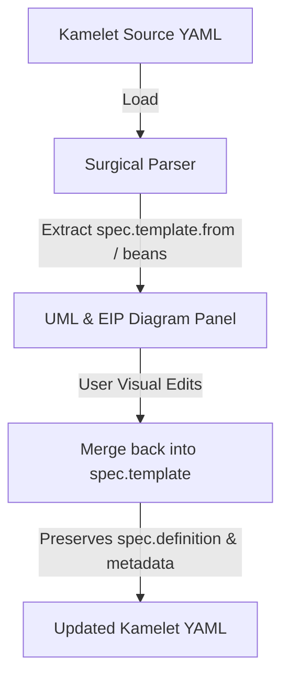

# Custom Kamelet Builder Studio

Kamelets (Camel Route Templates) are reusable endpoint definitions that hide complex connection configurations behind simple properties. The **Kamelet Studio** provides a visual environment to design, parameterize, and run tests on custom Kamelets.

---

## 1. Chapter-Based Tutorial System

Upon initialization, the studio pre-populates a tutorial structure inside the workspace to guide developers from simple endpoints to complex transaction-aware flows:

- **`tutorial/chapter-1-basics/`**: Basic timer source and log sink Kamelets.
- **`tutorial/chapter-2-databases/`**: MongoDB change stream sources, update actions, and SQL CRUD actions.
- **`tutorial/chapter-3-messaging/`**: Standard IBM MQ and Solace PubSub+ queue sink/source integrations.
- **`tutorial/chapter-4-transactions/`**: High-availability IBM MQ XA and Solace XA transaction-enabled configurations.

---

## 2. Structural Sync Flow

Kamelets wrap their route flow inside a `spec.template` block alongside metadata definition properties. The Kamelet Studio handles bidirectional editing without corrupting metadata.

---

## 3. Dynamic Parameter Form Generator

When testing a Kamelet, the studio inspects the `spec.definition.properties` and dynamically generates input form fields:
- Required parameters are bolded.
- Password-format properties automatically render masked password input fields.
- Default values are resolved and auto-filled.

---

## 4. Test Route Generator & JBang Execution

The studio automatically builds a mock Camel route depending on the Kamelet's type:
- **Source**: Consumes from `kamelet:my-kamelet?params` and pipes output to a `log` step.
- **Sink/Action**: Emits payload on a `timer` step and sends it to `kamelet:my-kamelet?params`.

This test route is executed using JBang with enabled catalog dependencies injected. Output is piped to the IDE's terminal console in real-time.
