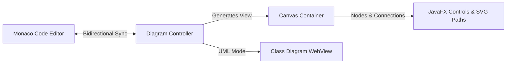

# Visual Route Designer

The visual route designer is the core workspace of the Route Builder IDE. It provides an infinite canvas allowing developers to visually construct, inspect, and configure Apache Camel Quarkus routes with live bidirectional code synchronization.

---

## 1. Core Architecture

The designer splits the viewport into a **Monaco Code Editor** (left) and an **Interactive Diagram Canvas** (right). It manages layout transitions, node rendering, and synchronization hooks.

---

## 2. Interactive Canvas features

- **Infinite Workspace**: Drag with the middle mouse button or scroll to pan, and use `Ctrl + Scroll` to zoom in/out dynamically.
- **SVG Bezier Connectors**: Connections between steps are rendered using custom-drawn SVG Bézier curves rather than simple straight lines, making complex branching (Splits, Multicasts, Choice) clean and readable.
- **Color-Coded Nodes**: Nodes are visually styled by type (e.g., Sources are Green, EIP steps are Blue, Beans are Purple, and REST endpoints are Orange).
- **Layout Toggles**: Swap panel placements instantly (Code Editor on right, Canvas on left) or toggle individual panel visibility via the **View** menu to focus on design or code.

---

## 3. Bidirectional Sync Mechanism

1. **YAML-to-Diagram**:
   - The editor runs a debounced parser. As you type YAML, it parses the Camel route structure and triggers `DiagramPane.renderDiagram()`.
   - The visual nodes, endpoint properties, and flow lines are updated in real-time.
2. **Diagram-to-YAML**:
   - Manipulating steps on the canvas (adding, editing properties, or deleting steps) triggers an internal AST update.
   - The updated route JSON is serialized to YAML format and injected back into the Monaco editor, preserving line placements.

---

## 4. Supported Route Patterns

- **Standard EIP Routes (`from` / `steps`)**: Supports standard patterns such as `timer`, `log`, `direct`, `choice`, `split`, `multicast`, and custom processors.
- **REST DSL (`rest`)**: Maps REST configurations, resource paths, HTTP verbs (`GET`, `POST`, `PUT`, `DELETE`), request/response parameters, and direct-to-route delegations.
- **UML & Bean Class Diagrams**: When Camel beans are declared, the canvas dynamically switches to a class diagram view, drawing class inheritance, instantiations, and bean-to-bean reference relationships.
